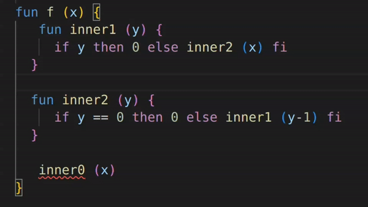
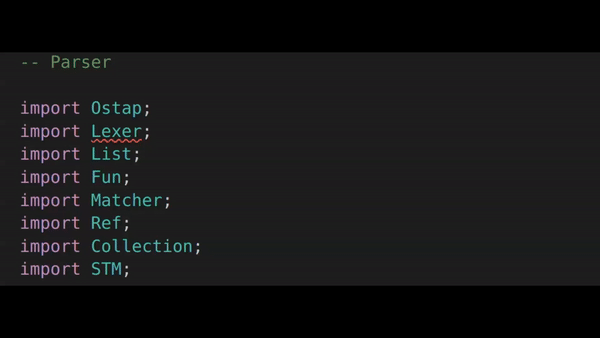
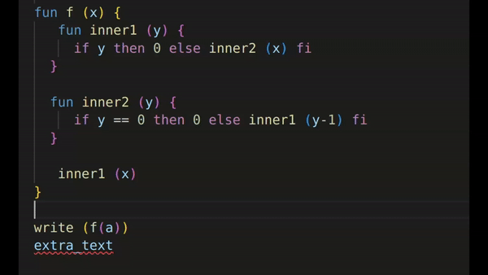

# Lama-LSP

Language Server for Lama based on vscode lsp-sample and Lama Language Extension.

## Features

- [ ] textDocument/completion
- [x] textdocument/hover
- [x] textDocument/definition
- [x] textDocument/documentHighlight
- [x] textDocument/references
- [ ] textDocument/formatting
- [x] workspace/symbol

## Functionality

This Language Server works for Lama language. It has the following language features:

- Syntax Highlighting

When you place the cursor on a symbol, all of its appearances in the code will also be highlighted.

- Go-To Definition

Using the "Go to Definition" function (F12 by default), the cursor will be moved to the code location where the symbol was defined.

- Find References

If you use the "Go to References" function (Shift+F12 by default), it will give you a list of places in the code where the given symbol occurs. If you further click on one of the occurences, the cursor will be moved to its location.
 

- Rename

When using the "Rename Symbol" function (F2), a pop-up box will appear in which you must enter a new symbol name. When you finish typing and press Enter, all occurrences of the symbol will be replaced by the entered value.

- Hover

When you move the cursor over a function, a pop-up window will appear with information about the function (name, arguments and comment, if it was left when declaring the function)
  

- File Diagnostic

Lsp server also supports file diagnostics for various language errors.

1. If a symbol is found in the code that implies a declared definition but does not have one - this symbol will be automatically underlined with the error "Cannot find name X"

2. If one of the imported modules is not found in the project/default modules list - the name of such module will be underlined with the error "Import error. Can't find module: X".

3. If parser errors are encountered in the file, they are also handled and underlined. Among them: EOF error, Missing Token Error and Parser Rule Error (NoViableAltException and EarlyExitException)

