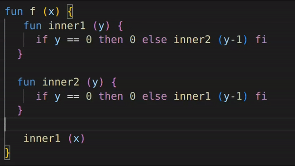

# Lama-LSP

Language Server for Lama based on vscode lsp-sample and Lama Language Extension.

## Features

- [ ] textDocument/completion
- [x] textdocument/hover
- [x] textDocument/definition
- [x] textDocument/documentHighlight
- [x] textDocument/references
- [ ] textDocument/formatting
- [x] workspace/symbol

## Functionality

This Language Server works for Lama language. It has the following language features:

- Syntax Highlighting

- Go-To Definition

- Find References
- 

- Rename

- Hover
  

- File Diagnostic
